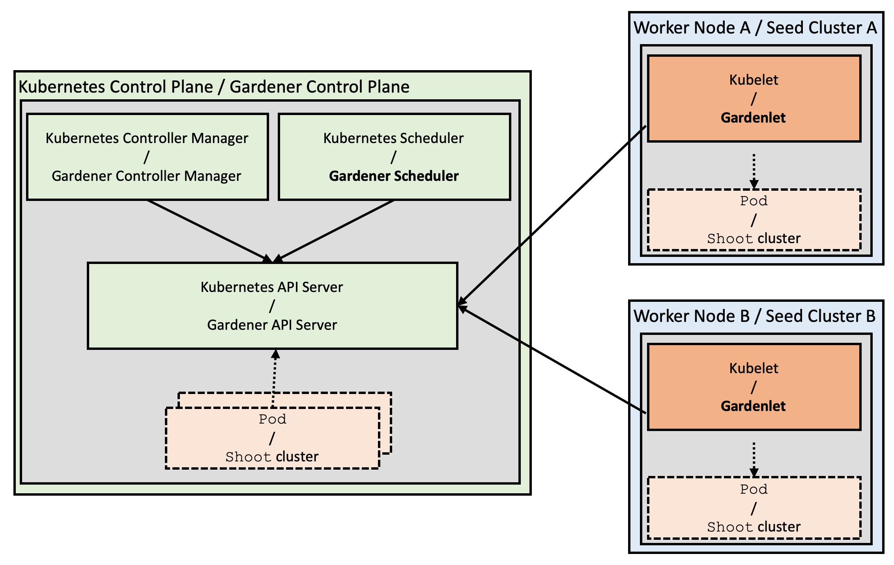
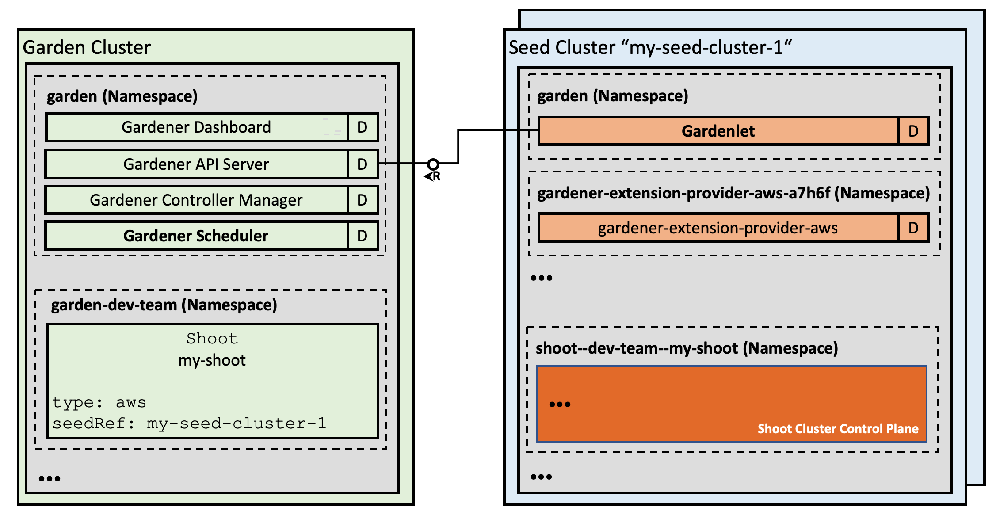

# Gardenlet

Gardener is implemented using the [operator pattern](https://kubernetes.io/docs/concepts/extend-kubernetes/operator/):
It uses custom controllers that act on our own custom resources,
and apply Kubernetes principles to manage clusters instead of containers.
Following this analogy, you can recognize components of the Gardener architecture
as well-known Kubernetes components, for example, shoot clusters can be compared with pods,
and seed clusters can be seen as worker nodes.

The following Gardener components play a similar role as the corresponding components
in the Kubernetes architecture:

| Gardener Component | Kubernetes Component |
|:---|:---|
| `gardener-apiserver` | `kube-apiserver` |
| `gardener-controller-manager` | `kube-controller-manager` |
| `gardener-scheduler` | `kube-scheduler` |
| `gardenlet` | `kubelet` |

Similar to how the `kube-scheduler` of Kubernetes finds an appropriate node
for newly created pods, the `gardener-scheduler` of Gardener finds an appropriate seed cluster
to host the control plane for newly ordered clusters.
By providing multiple seed clusters for a region or provider, and distributing the workload,
Gardener also reduces the blast radius of potential issues.

Kubernetes runs a primary "agent" on every node, the kubelet,
which is responsible for managing pods and containers on its particular node.
Decentralizing the responsibility to the kubelet has the advantage that the overall system
is scalable. Gardener achieves the same for cluster management by using a **gardenlet**
as primary "agent" on every seed cluster, and is only responsible for shoot clusters
located in its particular seed cluster:

The `gardener-controller-manager` has control loops to manage resources of the Gardener API. However, instead of letting the `gardener-controller-manager` talk directly to seed clusters or shoot clusters, the responsibility isn’t only delegated to the gardenlet, but also managed using a reversed control flow: It's up to the gardenlet to contact the Gardener API server, for example, to share a status for its managed seed clusters.

Reversing the control flow allows placing seed clusters or shoot clusters behind firewalls without the necessity of direct access via VPN tunnels anymore.

## TLS Bootstrapping

Kubernetes doesn’t manage worker nodes itself, and it’s also not
responsible for the lifecycle of the kubelet running on the workers.
Similarly, Gardener doesn’t manage seed clusters itself,
so Gardener is also not responsible for the lifecycle of the gardenlet running on the seeds.
As a consequence, both the gardenlet and the kubelet need to prepare
a trusted connection to the Gardener API server
and the Kubernetes API server correspondingly.

To prepare a trusted connection between the gardenlet
and the Gardener API server, the gardenlet initializes
a bootstrapping process after you deployed it into your seed clusters:

1. The gardenlet starts up with a bootstrap `kubeconfig`
   having a bootstrap token that allows to create `CertificateSigningRequest` (CSR) resources.

2. After the CSR is signed, the gardenlet downloads
   the created client certificate, creates a new `kubeconfig` with it,
   and stores it inside a `Secret` in the seed cluster.

3. The gardenlet deletes the bootstrap `kubeconfig` secret,
    and starts up with its new `kubeconfig`.

4. The gardenlet starts normal operation.

The `gardener-controller-manager` runs a control loop
that automatically signs CSRs created by gardenlets.

> The gardenlet bootstrapping process is based on the
> kubelet bootstrapping process. More information:
> [Kubelet's TLS bootstrapping](https://kubernetes.io/docs/reference/command-line-tools-reference/kubelet-tls-bootstrapping/).

If you don't want to run this bootstrap process you can create
a `kubeconfig` pointing to the garden cluster for the gardenlet yourself,
and use field `gardenClientConnection.kubeconfig` in the
gardenlet configuration to share it with the gardenlet.

## Gardenlet Certificate Rotation

The certificate used to authenticate the gardenlet against the API server
is valid for a year.
After about 10 months, the gardenlet tries to automatically replace
the current certificate with a new one (certificate rotation).

To use certificate rotation, you need to specify the secret to store
the `kubeconfig` with the rotated certificate in field
`.gardenClientConnection.kubeconfigSecret` of the
gardenlet [component configuration](#component-configuration).

### Rotate certificates using bootstrap `kubeconfig`

If the gardenlet created the certificate during the initial TLS Bootstrapping
using the Bootstrap `kubeconfig`, certificates can be rotated automatically.
The same control loop in the `gardener-controller-manager` that signs
the CSRs during the initial TLS Bootstrapping also automatically signs
the CSR during a certificate rotation.

### Rotate Certificate Using Custom `kubeconfig`

When trying to rotate a custom certificate that wasn’t created by gardenlet
as part of the TLS Bootstrap, the x509 certificate's `Subject` field
needs to conform to the following:
  - the Common Name (CN) is prefixed with `gardener.cloud:system:seed:`
  - the Organization (O) equals `gardener.cloud:system:seeds`

Otherwise, the `gardener-controller-manager` doesn’t automatically
sign the CSR.
In this case, an external component or user needs to approve the CSR manually,
for example, using command  `kubectl certificate approve  seed-csr-<...>`).
If that doesn’t happen within 15 minutes,
the gardenlet repeats the process and creates another CSR.

## Seed Config versus Seed Selector

The usage of the gardenlet is flexible:

| Usage | Description |
|:---|:---|
| `seedConfig` | Run one gardenlet per seed cluster inside the seed cluster itself.|
| `seedSelector` | Use one gardenlet to manage multiple seed clusters. The gardenlet can run outside of the seed cluster.|

> For production use it’s recommended to go for the `seedConfig` option,
> because it makes scaling easier and leads to a better distribution of responsibilities.

* Provide a `seedConfig` that contains information about the seed cluster itself
  if you want the gardenlet in the standard way,
  see [the example gardenlet configuration](../../example/20-componentconfig-gardenlet.yaml).
  Once bootstrapped, the gardenlet creates and updates its `Seed` object itself.

* Provide a `seedSelector` that incorporates a label selector for the
  targeted seed clusters if you want the gardenlet to manage multiple seeds,
  see [the example gardenlet configuration](../../example/20-componentconfig-gardenlet.yaml).
  In this case, you have to create the `Seed` objects
  together with a `kubeconfig` pointing to the cluster yourself.

## Component Configuration

In the component configuration for the gardenlet, it’s possible to define:

* settings for the Kubernetes clients interacting with the various clusters
* settings for the control loops inside the gardenlet
* settings for leader election and log levels, feature gates, and seed selection or seed configuration.

More information: [Example Gardenlet Component Configuration](../../example/20-componentconfig-gardenlet.yaml).

## Heartbeats

Similar to how Kubernetes uses `Lease` objects for node heart beats
(see [KEP](https://github.com/kubernetes/enhancements/blob/master/keps/sig-node/0009-node-heartbeat.md)),
the gardenlet is using `Lease` objects for heart beats of the seed cluster.
Every two seconds, the gardenlet checks that the seed cluster's `/healthz`
endpoint returns HTTP status code 200.
If that is the case, the gardenlet renews the lease in the Garden cluster in the `gardener-system-seed-lease` namespace and updates
the `GardenletReady` condition in the `status.conditions` field of the `Seed` resource(s).

Similarly to the `node-lifecycle-controller` inside the `kube-controller-manager`,
the `gardener-controller-manager` features a `seed-lifecycle-controller` that sets
the `GardenletReady` condition to `Unknown` in case the gardenlet fails to renew the lease.
As a consequence, the `gardener-scheduler` doesn’t consider this seed cluster for newly created shoot clusters anymore.

### `/healthz` Endpoint

The gardenlet includes an HTTPS server that serves a `/healthz` endpoint.
It’s used as a liveness probe in the `Deployment` of the gardenlet.
If the gardenlet fails to renew its lease
then the endpoint returns `500 Internal Server Error`, otherwise it returns `200 OK`.

> ⚠️  In case the gardenlet is managing multiple seeds
> (that is, a seed selector is used) then the `/healthz`
> reports `500 Internal Server Error` if there is at least one seed
> for which it couldn’t renew its lease. Only if it can renew the lease
> for all seeds it reports `200 OK`.

Please note, that the `/healthz` only indicates whether the gardenlet
could successfully probe the Seed's API server and renew the lease with
the Garden cluster.
It does *not* show that the Gardener extension API server (with the Gardener resource groups)
is available.
However, the Gardenlet is designed to withstand such connection outages and
retries until the connection is reestablished.

## Control Loops

The gardenlet consists out of several controllers which are now described in more detail.

⚠️ This section is not necessarily complete and might be under construction.

### `BackupEntry` Controller

The `BackupEntry` controller reconciles those `core.gardener.cloud/v1beta1.BackupEntry` resources whose `.spec.seedName` value is equal to the name of a `Seed` the respective gardenlet is responsible for.
Those resources are created by the `Shoot` controller (only if backup is enabled for the respective `Seed`) and there is exactly one `BackupEntry` per `Shoot`.

The controller creates an `extensions.gardener.cloud/v1alpha1.BackupEntry` resource (non-namespaced) in the seed cluster and waits until the responsible extension controller reconciled it (see [this](../extensions/backupentry.md) for more details).
The status is populated in the `.status.lastOperation` field.

The `core.gardener.cloud/v1beta1.BackupEntry` resource has an owner reference pointing to the corresponding `Shoot`.
Hence, if the `Shoot` is deleted, also the `BackupEntry` resource gets deleted.
In this case, the controller deletes the `extensions.gardener.cloud/v1alpha1.BackupEntry` resource in the seed cluster and waits until the responsible extension controller has deleted it.
Afterwards, the finalizer of the `core.gardener.cloud/v1beta1.BackupEntry` resource is released so that it finally disappears from the system.

#### Keep Backup for Deleted Shoots

In some scenarios it might be beneficial to not immediately delete the `BackupEntry`s (and with them, the etcd backup) for deleted `Shoot`s.

In this case you can configure the `.controllers.backupEntry.deletionGracePeriodHours` field in the component configuration of the gardenlet.
For example, if you set it to `48`, then the `BackupEntry`s for deleted `Shoot`s will only be deleted `48` hours after the `Shoot` was deleted.

Additionally, you can limit the [shoot purposes](../usage/shoot_purposes.md) for which this applies by setting `.controllers.backupEntry.deletionGracePeriodShootPurposes[]`.
For example, if you set it to `[production]` then only the `BackupEntry`s for `Shoot`s with `.spec.purpose=production` will be deleted after the configured grace period. All others will be deleted immediately after the `Shoot` deletion.

## Managed Seeds

Gardener users can use shoot clusters as seed clusters, so-called "managed seeds" (aka "shooted seeds"),
by creating `ManagedSeed` resources.
By default, the gardenlet that manages this shoot cluster then automatically
creates a clone of itself with the same version and the same configuration
that it currently has.
Then it deploys the gardenlet clone into the managed seed cluster.

If you want to prevent the automatic gardenlet deployment,
specify the `seedTemplate` section in the `ManagedSeed` resource, and don't specify
the `gardenlet` section.
In this case, you have to deploy the gardenlet on your own into the seed cluster.

More information: [Register Shoot as Seed](../usage/managed_seed.md)

## Migrating from Previous Gardener Versions

If your Gardener version doesn’t support gardenlets yet,
no special migration is required, but the following prerequisites must be met:

* Your Gardener version is at least 0.31 before upgrading to v1.
* You have to make sure that your garden cluster is exposed in a way
  that it’s reachable from all your seed clusters.

With previous Gardener versions, you had deployed the Gardener Helm chart
(incorporating the API server, `controller-manager`, and scheduler).
With v1, this stays the same, but you now have to deploy the gardenlet Helm chart as well
into all of your seeds (if they aren’t managed, as mentioned earlier).

More information: [Deploy a Gardenlet](../deployment/deploy_gardenlet.md) for all instructions.

## Related Links

[Gardener Architecture](https://github.com/gardener/documentation/wiki/Architecture)

[Issue #356: Implement Gardener Scheduler](https://github.com/gardener/gardener/issues/356)

[PR #2309: Add /healthz endpoint for Gardenlet](https://github.com/gardener/gardener/pull/2309)

