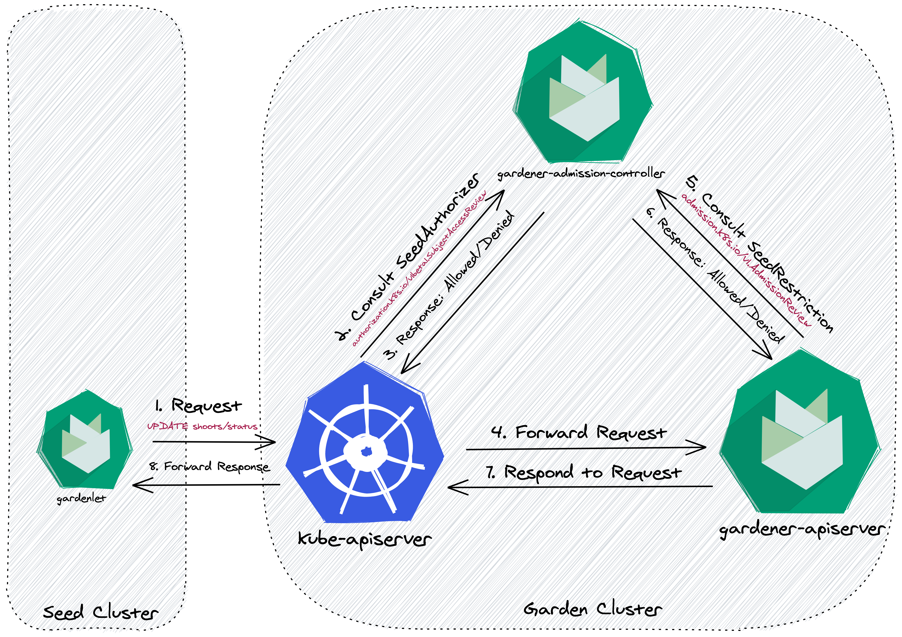

# Scoped API Access for Gardenlets

By default, `gardenlet`s have administrative access in the garden cluster.
They are able to execute any API request on any object independent of whether the object is related to the seed cluster the `gardenlet` is responsible fto.
As RBAC is not powerful enough for fine-grained checks and for the sake of security, Gardener provides two optional but recommended configurations for your environments that scope the API access for `gardenlet`s.

Similar to the [`Node` authorization mode in Kubernetes](https://kubernetes.io/docs/reference/access-authn-authz/node/), Gardener features a `SeedAuthorizer` plugin.
It is a special-purpose authorization plugin that specifically authorizes API requests made by the `gardenlet`s.

Likewise, similar to the [`NodeRestriction` admission plugin in Kubernetes](https://kubernetes.io/docs/reference/access-authn-authz/admission-controllers/#noderestriction), Gardener features a `NodeRestriction` plugin.
It is a special-purpose admission plugin that specifically limits the Kubrnetes objects `gardenlet`s can modify.

📚 You might be interested to look into the [design proposal for scoped Kubelet API access](https://github.com/kubernetes/community/blob/master/contributors/design-proposals/node/kubelet-authorizer.md) from the Kubernetes community.
It can be translated to Gardener and Gardenlets with their `Seed` and `Shoot` resources.

## Flow Diagram

The following diagram shows how the two plugins are included in the request flow of a `gardenlet`.
When they are not enabled then the `kube-apiserver` is internally authorizing the request via RBAC before forwarding the request directly to the `gardener-apiserver`, i.e., the `gardener-admission-controller` would not be consulted (this is not entirely correct because it also serves other admission webhook handlers, but for simplicity reasons this document focuses on the API access scope only).

When enabling the plugins, there is one additional step for each before the `gardener-apiserver` responds to the request. 

Please note that the example shows a request to an object (`Shoot`) residing in one of the API groups served by `gardener-apiserver`.
However, the `gardenlet` is also interacting with objects in API groups served by the `kube-apiserver` (e.g., `Secret`,`ConfigMap`, etc.).
In this case, the consultation of the `SeedRestriction` admission plugin is performed by the `kube-apiserver` itself before it forwards the request to the `gardener-apiserver`.

## `SeedAuthorizer` Authorization Webhook Enablement

The `SeedAuthorizer` is implemented as [Kubernetes authorization webhook](https://kubernetes.io/docs/reference/access-authn-authz/webhook/) and part of the [`gardener-admission-controller`](../concepts/admission-controller.md) component running in the garden cluster.

⚠️ This authorization plugin is still in development and should not be used yet.

## `SeedRestriction` Admission Webhook Enablement

The `SeedRestriction` is implemented as [Kubernetes admission webhook](https://kubernetes.io/docs/reference/access-authn-authz/extensible-admission-controllers/) and part of the [`gardener-admission-controller`](../concepts/admission-controller.md) component running in the garden cluster.

⚠️ This admission plugin is still in development and should not be used yet.
