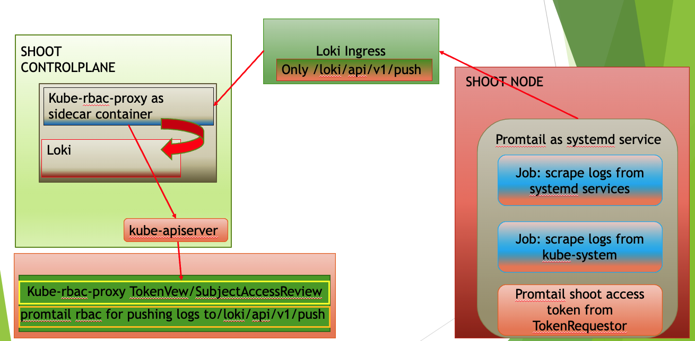
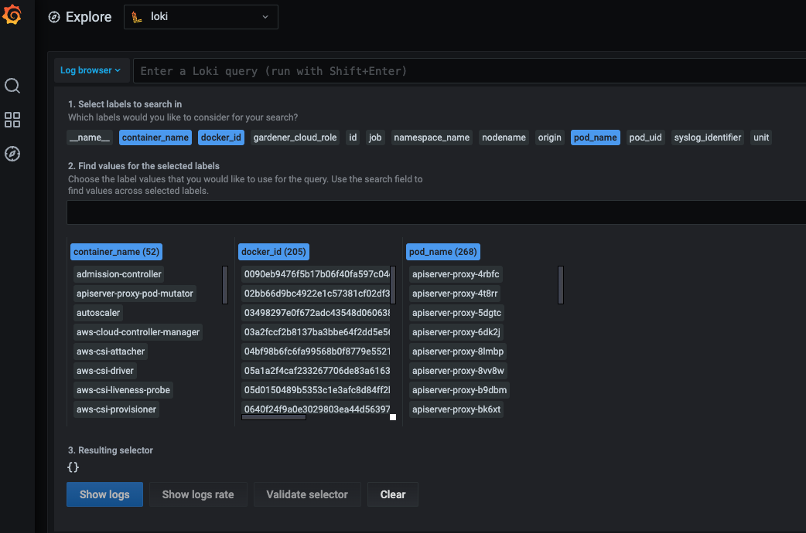

# Logging stack

### Motivation
Kubernetes uses the underlying container runtime logging, which does not persist logs for stopped and destroyed containers. This makes it difficult to investigate issues in the very common case of not running containers. Gardener provides a solution to this problem for the managed cluster components, by introducing its own logging stack.


### Components:

* A Fluent-bit daemonset which works like a log collector and custom Golang plugin which spreads log messages to their Loki instances
* One Loki Statefulset in the `garden` namespace which contains logs for the seed cluster and one per shoot namespace which contains logs for shoot's controlplane.
* One Grafana Deployment in `garden` namespace and two Deployments per shoot namespace (one exposed to the end users and one for the operators). Grafana is the UI component used in the logging stack.

### Container Logs rotation and retention

Container [log rotation](https://kubernetes.io/docs/concepts/cluster-administration/logging/#log-rotation) in Kubernetes describes a subtile but important implementation detail depending on the type of the used high-level container runtime. When a high-level container runtime is used (such as `docker shim`) then Kubernetes components do not provide any rotation or retention implementations, hence leaving those aspects to the downstream components. When `containerd` (a CRI-based container runtime) is used then the `kubelet` provides the necessary implementation with two configuration options:
- `ContainerLogMaxSize` for rotation
- `ContainerLogMaxFiles` for retention.

#### Docker container runtime

In this case, the log rotation and retention is implemented by a `logrotate` service provisioned by Gardener which rotates logs once `100M` size is reached. Logs are compressed on daily basis and retained for a maximum period of `14d`.

#### ContainerD runtime

In this case, the `Shoot` specification may contain `ContainerLogMaxSize` and `ContainerLogMaxFiles`. Both are optional and if nothing is specified then the
kubelet rotates on the same size `100M` as in the docker container runtime.

```yaml
kubernetes:
    kubelet:
      # accepted values are of resource.Quantity
      containerLogMaxSize: 150Mi
      containerLogMaxFiles: 10
```

Those values of the `ContainerLogMaxSize` and `ContainerLogMaxFiles` properties needs to be considered with care since container log files claims disk space from the host. On the oposite side ,log rotations on sizes too small may result in frequent rotations which can be missed by other components (log shippers) observing these rotations.

In the majority of the cases the defaults shall do just. Custom configuration might be of use under rare conditions.

### Extension of the logging stack

The logging stack is extended to scrape logs from the systemd services of each shoots' nodes and from all Gardener components in the shoot `kube-system` namespace. These logs are exposed only to the Gardener operators.

Also, in the shoot control plane an `event-logger` pod is deployed which scrapes events from the shoot `kube-system` namespace and shoot `control-plane` namespace in the seed. The `event-logger` logs the events to the standard output. Then the `fluent-bit` gets these events as container logs and sends them to the Loki in the shoot control plane (similar to how it works for any other control plane component).

### How to access the logs
The first step is to authenticate in front of the Grafana ingress.
There are two Grafana instances where the logs are accessible from.
  1. The user (stakeholder/cluster-owner) Grafana consist of a predefined  `Monitoring and Logging` dashboards which help the end-user to get the most important metrics and logs out of the box. This Grafana UI is dedicated only for the end-user and does not show logs from components which could log a sensitive information. Also, the `Explore` tab is not available. Those logs are in the predefined dashboard named `Controlplane Logs Dashboard`.
  In this dashboard the user can search logs by `pod name`, `container name`, `severity` and `a phrase or regex`.
  The user Grafana URL can be found in the `Logging and Monitoring` section of a cluster in the Gardener Dashboard alongside with the credentials, when opened as cluster owner/user.
  The secret with the credentials can be found in `garden-<project>` namespace under `<shoot-name>.monitoring` in the garden cluster or in the `control-plane` (shoot--project--shoot-name) namespace under `observability-ingress-users-<hash>` secrets in the seed cluster.
  Also, the Grafana URL can be found in the `control-plane` namespace under the `grafana-users` ingress in the seed.
  The end-user has access only to the logs of some of the control-plane components.

  2. In addition to the dashboards in the User Grafana, the Operator Grafana contains several other dashboards that aim to facilitate the work of operators.
  The operator Grafana URL can be found in the `Logging and Monitoring` section of a cluster in the Gardener Dashboard alongside with the credentials, when opened as Gardener operator.
  Also, it can be found in the `control-plane` namespace under the `grafana-operators` ingress in the seed.
  Operators have access to the `Explore` tab.
  The secret with the credentials can be found in the `control-plane` (shoot--project--shoot-name) namespace under `observability-ingress-<hash>-<hash>` secrets in the seed.
  From `Explore` tab, operators have unlimited abilities to extract and manipulate logs.
  The Grafana itself helps them with suggestions and auto-completion.
  > **_NOTE:_** Operators are people part of the Gardener team with operator permissions, not operators of the end-user cluster!

#### How to use `Explore` tab.
If you click on the `Log browser >` button you will see all of the available labels.
Clicking on the label you can see all of its available values for the given period of time you have specified.
If you are searching for logs for the past one hour do not expect to see labels or values for which there were no logs for that period of time.
By clicking on a value, Grafana automatically eliminates all other label and/or values with which no valid log stream can be made.
After choosing the right labels and their values, click on `Show logs` button.
This will build `Log query` and execute it.
This approach is convenient when you don't know the labels names or they values.


Once you felt comfortable, you can start to use the [LogQL](https://grafana.com/docs/loki/latest/logql/log_queries/) language to search for logs.
Next to the `Log browser >` button is the place where you can type log queries.

Examples:
1. If you want to get logs for `calico-node-<hash>` pod in the cluster `kube-system`.
  The name of the node on which `calico-node` was running is known but not the hash suffix of the `calico-node` pod.
  Also we want to search for errors in the logs.

    ```{pod_name=~"calico-node-.+", nodename="ip-10-222-31-182.eu-central-1.compute.internal"} |~ "error"```

     Here, you will get as much help as possible from the Grafana by giving you suggestions and auto-completion.

2. If you want to get the logs from `kubelet` systemd service of a given node and search for a pod name in the logs.

    ```{unit="kubelet.service", nodename="ip-10-222-31-182.eu-central-1.compute.internal"} |~ "pod name"```
  > **_NOTE:_** Under `unit` label there is only the `docker`, `containerd`, `kubelet` and `kernel` logs.

3. If you want to get the logs from `cloud-config-downloader` systemd service of a given node and search for a string in the logs.

    ```{job="systemd-combine-journal",nodename="ip-10-222-31-182.eu-central-1.compute.internal"} | unpack | unit="cloud-config-downloader.service" |~ "last execution was"```
> **_NOTE:_** `{job="systemd-combine-journal",nodename="<node name>"}` stream [pack](https://grafana.com/docs/loki/latest/clients/promtail/stages/pack/) all logs from systemd services except `docker`, `containerd`, `kubelet` and `kernel`. To filter those log by unit you have to [unpack](https://grafana.com/docs/loki/latest/logql/log_queries/#unpack) them first.

4. Retrieving events:
  - If you want to get the events from the shoot `kube-system` namespace generated by `kubelet` and related to the `node-problem-detector`:

    ```{job="event-logging"} | unpack | origin_extracted="shoot",source="kubelet",object=~".*node-problem-detector.*"```

  - If you want to get the events generated by MCM in the shoot control plane in the seed:

    ```{job="event-logging"} | unpack | origin_extracted="seed",source=~".*machine-controller-manager.*"```

  > **_NOTE:_** In order to group events by origin one has to specify `origin_extracted` because `origin` label is reserved for all of the logs from the seed and the `event-logger` resides in the seed, so all of its logs are coming as they are only from the seed. The actual origin is embedded in the unpacked event. When unpacked the embedded `origin` becomes `origin_extracted`.

### Expose logs for component to User Grafana
Exposing logs for a new component to the User's Grafana is described [here](../extensions/logging-and-monitoring.md#how-to-expose-logs-to-the-users)
### Configuration

#### Fluent-bit

The Fluent-bit configurations can be found on `charts/seed-bootstrap/charts/fluent-bit/templates/fluent-bit-configmap.yaml`
There are five different specifications:

* SERVICE: Defines the location of the server specifications
* INPUT: Defines the location of the input stream of the logs
* OUTPUT: Defines the location of the output source (Loki for example)
* FILTER: Defines filters which match specific keys
* PARSER: Defines parsers which are used by the filters

#### Loki
The Loki configurations can be found on `charts/seed-bootstrap/charts/loki/templates/loki-configmap.yaml`

The main specifications there are:

* Index configuration: Currently is used the following one:
```
    schema_config:
      configs:
      - from: 2018-04-15
        store: boltdb
        object_store: filesystem
        schema: v11
        index:
          prefix: index_
          period: 24h
```
* `from`: is the date from which logs collection is started. Using a date in the past is okay.
* `store`: The DB used for storing the index.
* `object_store`: Where the data is stored
* `schema`: Schema version which should be used (v11 is currently recommended)
* `index.prefix`: The prefix for the index.
* `index.period`: The period for updating the indices

**Adding of new index happens with new config block definition. `from` field should start from the current day + previous `index.period` and should not overlap with the current index. The `prefix` also should be different**
```
    schema_config:
      configs:
      - from: 2018-04-15
        store: boltdb
        object_store: filesystem
        schema: v11
        index:
          prefix: index_
          period: 24h
      - from: 2020-06-18
        store: boltdb
        object_store: filesystem
        schema: v11
        index:
          prefix: index_new_
          period: 24h
```

* chunk_store_config Configuration
```
    chunk_store_config:
      max_look_back_period: 336h
```
**`chunk_store_config.max_look_back_period` should be the same as the `retention_period`**

* table_manager Configuration
```
    table_manager:
      retention_deletes_enabled: true
      retention_period: 336h
```
`table_manager.retention_period` is the living time for each log message. Loki will keep messages for sure for (`table_manager.retention_period` - `index.period`) time due to specification in the Loki implementation.

#### Grafana
The Grafana configurations can be found on  `charts/seed-bootstrap/charts/templates/grafana/grafana-datasources-configmap.yaml` and
`charts/seed-monitoring/charts/grafana/tempates/grafana-datasources-configmap.yaml`

This is the Loki configuration that Grafana uses:

```
    - name: loki
      type: loki
      access: proxy
      url: http://loki.{{ .Release.Namespace }}.svc:3100
      jsonData:
        maxLines: 5000
```

* `name`: is the name of the datasource
* `type`: is the type of the datasource
* `access`: should be set to proxy
* `url`: Loki's url
* `svc`: Loki's port
* `jsonData.maxLines`: The limit of the log messages which Grafana will show to the users.

**Decrease this value if the browser works slowly!**
