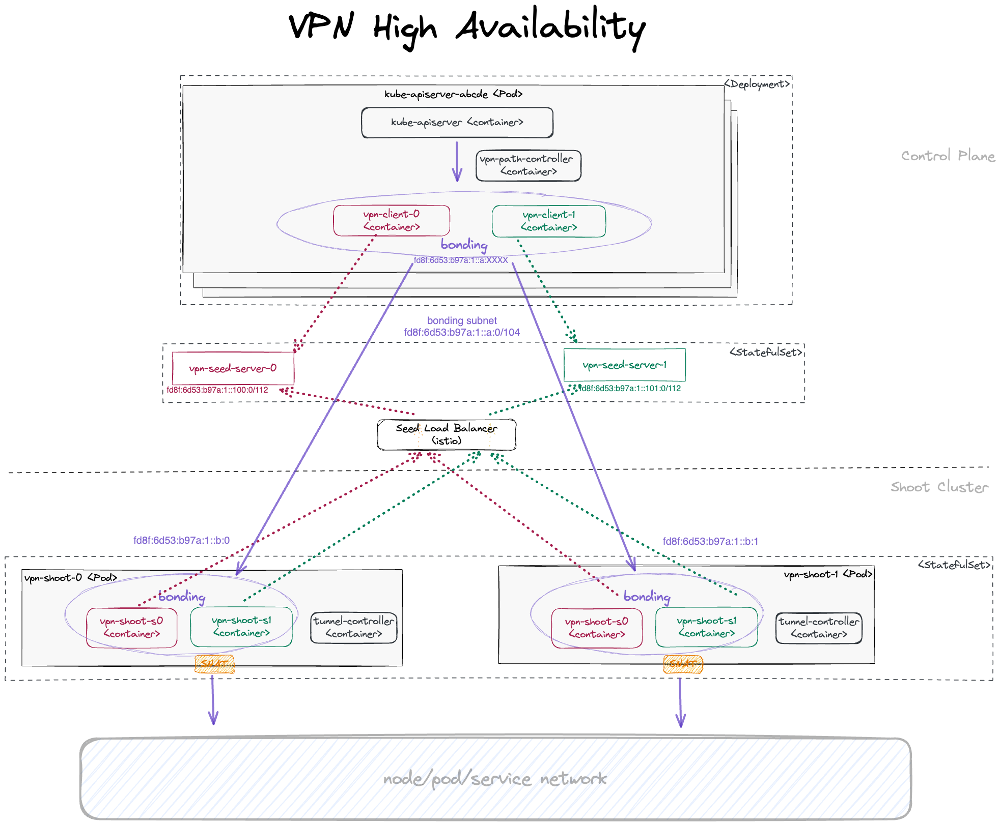
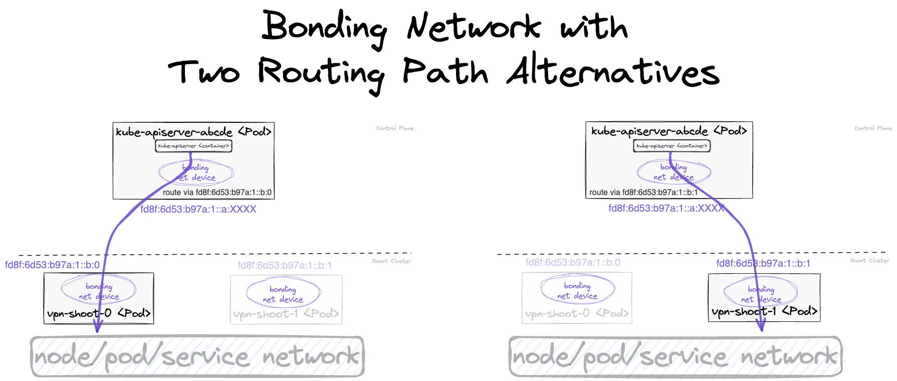

# Reversed VPN Tunnel Setup and Configuration 

This is a short guide describing how to enable tunneling traffic from shoot cluster to seed cluster instead of the default "seed to shoot" direction. 

## The OpenVPN Default

By default, Gardener makes use of OpenVPN to connect the shoot controlplane running on the seed cluster to the dataplane 
running on the shoot worker nodes, usually in isolated networks. This is achieved by having a sidecar to certain control plane components such as the `kube-apiserver` and `prometheus`. 

With a sidecar, all traffic directed to the cluster is intercepted by iptables rules and redirected 
to the tunnel endpoint in the shoot cluster deployed behind a cloud loadbalancer. This has the following disadvantages: 

- Every shoot would require an additional loadbalancer, this accounts for additional overhead in terms of both costs and troubleshooting efforts.
- Private access use-cases would not be possible without having a seed residing in the same private domain as a hard requirement. For example, have a look at [this issue](https://github.com/gardener/gardener-extension-provider-gcp/issues/56)
- Providing a public endpoint to access components in the shoot poses a security risk.

This is how it looks like today with the OpenVPN solution:

`APIServer | VPN-seed ---> internet ---> LB --> VPN-Shoot (4314) --> Pods | Nodes | Services`


## Reversing the Tunnel

To address the above issues, the tunnel can establishment direction can be reverted, i.e. instead of having the client reside in the seed, 
we deploy the client in the shoot and initiate the connection from there. This way, there is no need to deploy a special purpose 
loadbalancer for the sake of addressing the dataplane, in addition to saving costs, this is considered the more secure alternative. 
For more information on how this is achieved, please have a look at the following [GEP](../proposals/14-reversed-cluster-vpn.md). 

How it should look like at the end:

`APIServer --> Envoy-Proxy | VPN-Seed-Server <-- Istio/Envoy-Proxy <-- SNI API Server Endpoint <-- LB (one for all clusters of a seed) <--- internet <--- VPN-Shoot-Client --> Pods | Nodes | Services`

### How to Configure

To enable the usage of the reversed vpn tunnel feature, either the Gardenlet `ReversedVPN` feature-gate must be set to `true` as shown below or the shoot must be annotated with `"alpha.featuregates.shoot.gardener.cloud/reversed-vpn: true"`.

```yaml
featureGates:
  ReversedVPN: true
``` 
Please refer to the examples [here](https://github.com/gardener/gardener/blob/master/example/20-componentconfig-gardenlet.yaml) for more information.

To disable the feature-gate the shoot must be annotated with `"alpha.featuregates.shoot.gardener.cloud/reversed-vpn: false"`

Once the feature-gate is enabled, a `vpn-seed-server` deployment will be added to the controlplane. The `kube-apiserver` will be configured to connect to resources in the dataplane such as pods, services and nodes though the `vpn-seed-service` via http proxy/connect protocol.
In the dataplane of the cluster, the `vpn-shoot` will establish the connection to the `vpn-seed-server` indirectly using the SNI API Server endpoint as a http proxy. After the connection has been established requests from the `kube-apiserver` will be handled by the tunnel.

> Please note this feature is still in Beta, so you might see instabilities every now and then.

## High Availability for Reversed VPN Tunnel

Shoots which define `spec.controlPlane.highAvailability.failureTolerance: {node, zone}` get an HA control-plane including a
highly available VPN connection by deploying redundant VPN servers and clients. 

Please note that it is not possible to move an open connection to another VPN tunnel. Especially long-running
commands like `kubectl exec -it ...` or `kubectl logs -f ...` will still break if the routing path must be switched 
because either VPN server or client are not reachable anymore. New request should be possible within seconds.

### HA Architecture for VPN

Establishing a connection from the VPN client on the shoot to the server in the control plane works nearly the same
way as in the non-HA case. The only difference is that the VPN client targets one of two VPN server, represented by two services 
`vpn-seed-server-0` and `vpn-seed-server-1` with endpoints in pods with the same name.
The VPN tunnel is used by a `kube-apiserver` to reach nodes, services, or pods in the shoot cluster. 
In the non-HA case, a kube-apiserver uses an HTTP proxy running as a side-car in the VPN server to address
the shoot networks via the VPN tunnel and the `vpn-shoot` acting as router.
In the HA case, the setup is more complicated. Instead of an HTTP proxy in the VPN server, the kube-apiserver has
additional side-cars. One side-car for each VPN client to connect to the corresponding VPN server.
On the shoot side there are now two `vpn-shoot` pods, each with two VPN clients for each VPN server.
With this setup, there would be four possible routes, but only one can be used. Switching the route kills all
open connections. Therefore, another layer is introduced: link aggregation, also named [bonding](https://www.kernel.org/doc/Documentation/networking/bonding.txt).
In Linux, you can create a network link by using several other links as slaves. Bonding is here used with
active-backup mode. This means the traffic goes only through the active sublink and is only changed if the active
becomes unavailable. Switching happens in the bonding network driver without changing any routes. So with this layer, 
vpn-seed-server pods can be rolled without disrupting open connections.



With bonding, there are 2 possible routing paths, ensuring that there is at least one routing path intact even if
one `vpn-seed-server` pod and one `vpn-shoot` pod are unavailable at the same time.

As it is not possible to use multipath routing, one routing path must be configured explicitly.
For this purpose, the `path-controller` script is running in another side-car of the kube-apiserver pod.
It pings all shoot-side VPN clients regularly every few seconds. If the active routing path is not responsive anymore,
the routing is switched to the other responsive routing path.



For general information about HA control-plane see [GEP-20](../proposals/20-ha-control-planes.md). 
